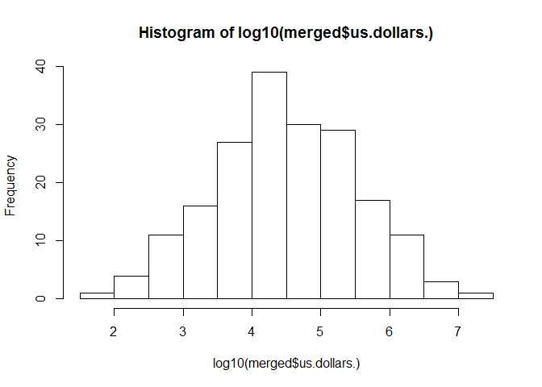
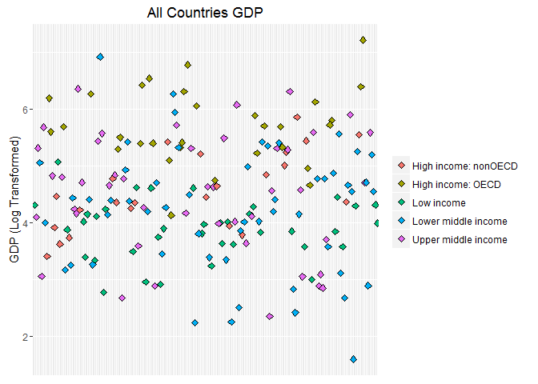
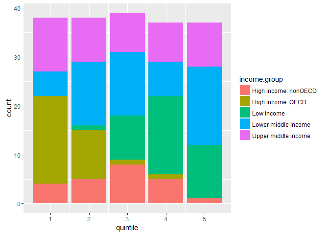

Introduction
------------

The purpose of this research is to analyze economic GDP data. More specifically, we are seeking to analyze GDP performances of countries in comparison to their income groups, and see how income group effects a country's GDP performance. To perform this analysis, data must be retrieved from two separate database. This requires the data to be pulled, cleaned, combined, and prepped for analysis.

Data Sources
------------

The data was directly collected from WorldBank.org resources. Specifically, 2 World Bank databases were used; the GDP Ranking Table for figures on GDP performance, and educational data for income group classification.

``` r
## Initialization
library(plyr)
library(gdata)
```

    ## gdata: Unable to locate valid perl interpreter
    ## gdata: 
    ## gdata: read.xls() will be unable to read Excel XLS and XLSX files
    ## gdata: unless the 'perl=' argument is used to specify the location
    ## gdata: of a valid perl intrpreter.
    ## gdata: 
    ## gdata: (To avoid display of this message in the future, please
    ## gdata: ensure perl is installed and available on the executable
    ## gdata: search path.)

    ## gdata: Unable to load perl libaries needed by read.xls()
    ## gdata: to support 'XLX' (Excel 97-2004) files.

    ## 

    ## gdata: Unable to load perl libaries needed by read.xls()
    ## gdata: to support 'XLSX' (Excel 2007+) files.

    ## 

    ## gdata: Run the function 'installXLSXsupport()'
    ## gdata: to automatically download and install the perl
    ## gdata: libaries needed to support Excel XLS and XLSX formats.

    ## 
    ## Attaching package: 'gdata'

    ## The following object is masked from 'package:stats':
    ## 
    ##     nobs

    ## The following object is masked from 'package:utils':
    ## 
    ##     object.size

    ## The following object is masked from 'package:base':
    ## 
    ##     startsWith

``` r
library(ggplot2)

## Download the data
GDPurl <- "https://d396qusza40orc.cloudfront.net/getdata%2Fdata%2FGDP.csv"
EDUurl <- "https://d396qusza40orc.cloudfront.net/getdata%2Fdata%2FEDSTATS_Country.csv"

GDP <- read.csv(GDPurl, skip=3, header=TRUE)
EDU <- read.csv(EDUurl, header=TRUE)
```

Preparing the Data
------------------

Once the raw data was acquired, several steps were required to clean, combine and prepare the data for further analysis. Primary among these tasks was to make the format of the data consistent across the 2 databases. This required renaming of variables for consistency, and removing information that is not describing individual countries in the GDP database.

``` r
## Check the data
head(GDP)
str(GDP)
head(EDU)
str(EDU)
```

``` r
## make all variable names lower case for uniformity
names(GDP) <- tolower(names(GDP))
names(EDU) <- tolower(names(EDU))
```

``` r
## rename columns in GDP
colnames(GDP)[1] <- "countrycode"
colnames(GDP)[6] <- "notes"

## drop empty columns from GDP
GDP$x.1 <- NULL
GDP$x.3 <- NULL
GDP$x.4 <- NULL
GDP$x.5 <- NULL
GDP$x.6 <- NULL

# remove non-country entry rows of data from GDP
GDP <- GDP[-192:-237,]
```

Once the individual databases were prepared with consistent data classification, the databases were merged by country code.

``` r
## merge data sets
merged <- merge(GDP,EDU,by="countrycode")
```

Analysis
--------

Once the data has was merged into a working database, it could be analyzed.

### Research Question 1

The first research question of this study was how many countries could be coordinated between the 2 databases to complete the combined analysis. In this case, 189 countries could be identified in both databases and thus were considered in the analysis.

``` r
## count matched IDs 
length(merged$us.dollars.)
```

    ## [1] 189

### Research Question 2

The second question for analysis is ranking of GDP size for all countries. We are also interested in what country is 13th from bottom in this database. We find this country to be St. Kitts and Nevis.

``` r
## Coerce GDP data to numeric, then sort by ascending GDP so that USA is last
merged$us.dollars. <- as.numeric(gsub("[^[:digit:]]","", merged$us.dollars.))
sort.merged.gdp <- merged[order(merged$us.dollars.) , ]

## Find country name with 13th biggest GDP
sort.merged.gdp$economy[13]
```

    ## [1] St. Kitts and Nevis
    ## 229 Levels:    East Asia & Pacific   Euro area ... Zimbabwe

### Research Question 3

The third question that we investigated was to compare the average GDP ranking for "High income:OECD" countries against the average GDP ranking for "High income: nonOECD" countries. Regarding this query, we find those rankings to be 32.967 and 91.913, respectively, showing that the average rank of high income OECD countries is approximately 58 spots higher than high income nonOECD countries. This shows a highly significant difference in GDP performance between these income groupings.

``` r
## calculate average GDP rankings for the "High income: OECD" 
## create subset of data for high income: OECD countries only
highincomeOECD <- merged[which(merged$income.group == "High income: OECD"),]
## Run calculations on subsetted data
highincomeOECD$ranking <- as.numeric(gsub("[^[:digit:]]","", highincomeOECD$ranking))
mean(highincomeOECD$ranking)
```

    ## [1] 32.96667

``` r
## calculate average GDP rankings for the "High income: nonOECD"
## create subset of data for high income: nonOECD countries only
highincome.nonOECD <- merged[which(merged$income.group == "High income: nonOECD"),]
## Run calculations on subsetted data
highincome.nonOECD$ranking <- as.numeric(gsub("[^[:digit:]]","", highincome.nonOECD$ranking))
mean(highincome.nonOECD$ranking)
```

    ## [1] 91.91304

### Research Question 4

Next we sought to visually examine the GDP values for all countries. Furthermore, we separated the values by income grouping to identify patterns. Furthermore, to create a visual plot of this information, it was necessary to perform a log transformation of GDP values. This is because the raw GDP values create a heavily right-skewed distribution.

Once transformed and plotted, a few noteworthy results of this analysis reveals that; 1) high-income OECD countries consistently have large GDPs, 2) high-income nonOECD countries rarely enter the upper rankings of GDP, but generally outperform low income countries, 3) upper middle income countries span a wide area of the rankings, but often approach high GDP levels, and 4) lower middle income countries are clustered around the low end of the rankings, with a few outliers with very high GDPs.

``` r
## plot GDP for all countries, with observations colored by income group, remove x-labels
hist(log10(merged$us.dollars.))
```



``` r
ggplot(merged, aes(x=economy, y=log10(us.dollars.))) + geom_point(size=2,
                                                                  shape=23, aes(fill=merged$income.group)) + xlab(NULL) + ylab("GDP (Log Transformed)") + labs("Income Group)")+
  theme(axis.text.x=element_blank(),
        axis.ticks.x=element_blank(), legend.title=element_blank()) + ggtitle("All Countries GDP")
```



### Research Question 5

Our final research inquiry was to more specifically compare GDP rank to income grouping. First, we divided each country into a GDP rank quintiles, 1 through 5. Next, we created a stacked bar chart that differentiates the income groups. This stacked bar chart is very helpful in more clearly demonstrating the trends that were suggested by the scatter plot in research question 4.

``` r
## Cut GDP ranking into 5 separate quantiles by using nested ifelse statements to create a new column in the dataframe
sort.merged.gdp$ranking <- as.numeric(gsub("[^[:digit:]]","", sort.merged.gdp$ranking))
sort.merged.gdp$quintile <- ifelse(sort.merged.gdp$ranking < 39, 1,
     ifelse(sort.merged.gdp$ranking >= 39 & sort.merged.gdp$ranking <= 76, 2,
     ifelse(sort.merged.gdp$ranking >= 77 & sort.merged.gdp$ranking <= 115, 3,
     ifelse(sort.merged.gdp$ranking >= 116 & sort.merged.gdp$ranking <= 153, 4,
     ifelse(sort.merged.gdp$ranking >= 154 & sort.merged.gdp$ranking <= 190, 5, NA)))))
  
## Make a table for GDP quintile vs Income Group
ggplot(data = sort.merged.gdp, aes(x = quintile, fill = income.group)) + 
  geom_bar()
```



Lastly, we investigated how many lower middle income countries rise to the top quintile of GDP (top 38 nations). We found that there were 5 countries that met this criteria.

``` r
## How many countries are lower middle income but among the 38 nations with highest GDP?
length(sort.merged.gdp$quintile[which(sort.merged.gdp$quintile == 1 & sort.merged.gdp$income.group == "Lower middle income")])
```

    ## [1] 5

Conclusion
----------

In sum, through our analysis we were able to identify several trends in how income group effects GDP performance. Foremost among them is that high income: OECD countries are heavily clustered towards the top of the GDP rankings. Second, low income countries countries fall towards the bottom of GDP rank. The other three categories of income, high income: nonOECD, lower middle income, and upper middle income, display varying GDP performance, generally centered around the middle of the rankings.
